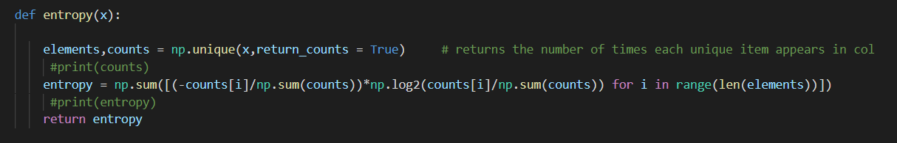
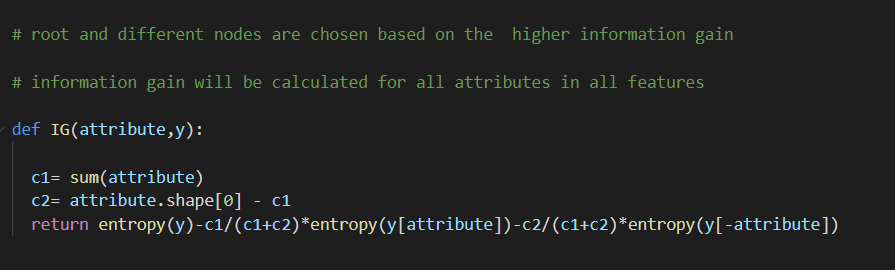
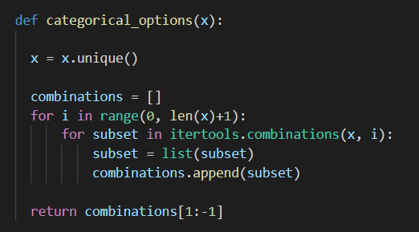
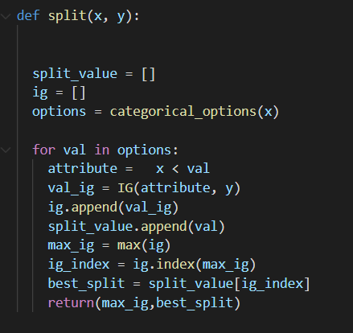

# Machine Learning

# Assignment #3  DT

##### 

| Submitted by:            | Sec. | B.N. |
| ------------------------ | ---- | ---- |
| Alaa Allah Essam Abdrabo | 1    | 13   |

* # This assignment is composed of 2 Problems.

* # Part1 :

  * #  Recommend another type of trees than ID3 that would build a less deep tree than ID3, Assume that you are building a complete ID3 tree. Justify your choice

    * ## types of Decision trees
    
       1. ID3 (Iterative Dichotomiser 3)(It is not an ideal algorithm as it generally overfits the data and on continuous variables, splitting the data can be time consuming.)
       2. C4.5 (successor of ID3)(The splitting is done based on the normalized information gain and the feature having the highest information gain makes the decision. Unlike ID3, it can handle both continuous and discrete attributes very efficiently and after building a tree, it undergoes pruning by removing all the branches having low importance.)
       3. CART (Classification And Regression Tree)
       4. CHAID (CHi-squared Automatic Interaction Detector). ...
       5. MARS(Multivariate adaptive regression splines ): extends decision trees to handle numerical data better.

    * ## CHAID (Chi-Square automatic interaction detector) 
    ### this method could give a less deep tree as uses a statistical rule to stop tree growth called the Chi-Square test. The Chi-Square test qualifies the values observed, to those in theory. Values which are far off from theory, independent, are cut off and the tree stops at that branch.

    * ## a techinque that can reduce size of tree :
 
      ### Pruning is the process of reducing the size of the tree by turning some branch nodes into leaf nodes, and removing the leaf nodes under the original branch.

      * pre-prunning:
        Stop splitting the current node if it does not improve the entropy by at least some pre-set(threshold) value.
        Stop partitioning if the number of datapoints are less then some preset(Threshold) values.
        Restricting the depth of the tree to some pre-set(Threshold) value.

      * Post-prunning:
        It can be done by first allowing the tree to grow to its full potential and then prunning the tree at each level after calculating the cross-validation accuracy at each level.

* # Part2 :

 * ## Implement the CART decision tree learning algorithm
 
 * ## Required functions

    ## Entropy

    

    ## Information gain
    
    

    ## Every feature in data has diffierent attributes that are but in collections to calculate information gain

    

    ## splitting is based on highest information gain

    

    