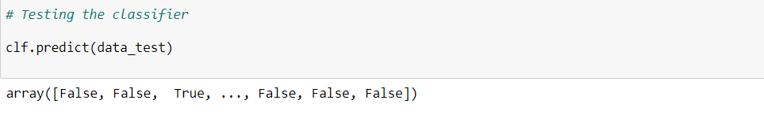
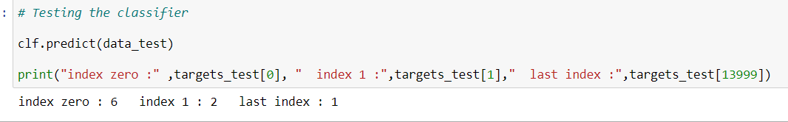
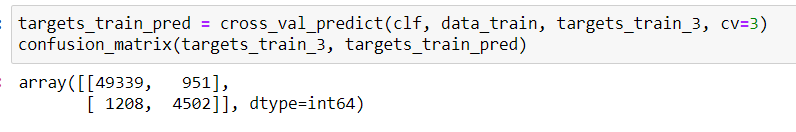
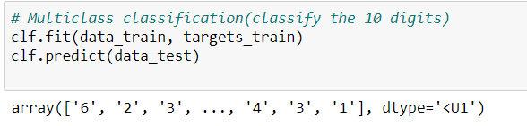
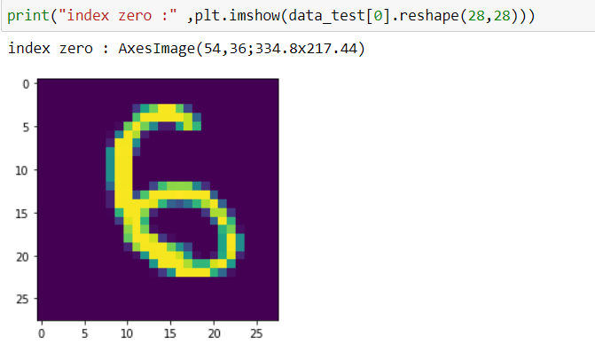
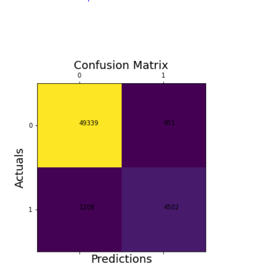

# ML_Task_1-mnist-dataset-
# 1. 5 examples from the used mnist dataset :
 * ## Checking of random targets indices to know their values and Extracting their corresponding images from dataset.
  ```python 
# Extracting data and target variables
data, targets = mnist["data"], mnist["target"]   # data_shape : (70000, 784) & targets_shape :(70000,) 

# 5 examples from the mnist dataset

#targets[7]        # "3"
#targets [77]      # "1"
#targets [777]     # "8"
#targets[7776]     # "2"
#targets [6777]    # "7"

digits=[7,77,777,7776,6777]

for i in range(5):
    
  digit=data[digits[i]].reshape(28, 28)
  plt.imshow(digit)
  plt.show()

```
* ## Extracted images :
------


## 2. Findings of the requirements 

* ## Binary classification using SGD classifier


* Checking if these predictions are true



* The confusion matrix


* Multiclass classification prediction

* ### check prediction


## 3. The output of the confusion matrix

```python
TN=conf_matrix[0][0]  # 49339
FP=conf_matrix[0][1]  # 951
FN=conf_matrix[1][0]  # 1208
TP=conf_matrix[1][1]  # 4502
```
  
  
  
